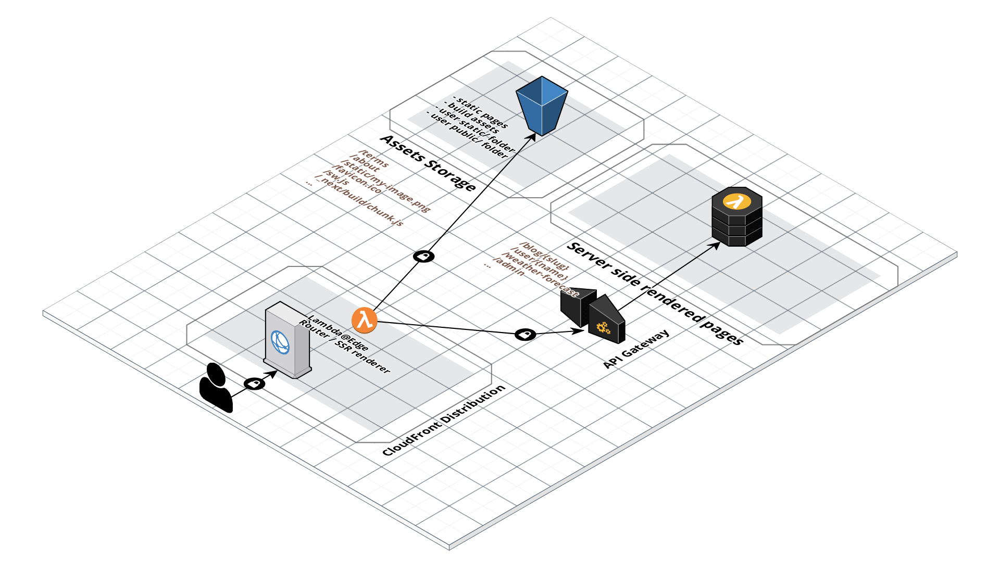

# Serverless Nextjs Component

A zero configuration Nextjs 9.0 [serverless component](https://github.com/serverless-components/) with full feature parity.

[](http://www.serverless.com)
[](https://travis-ci.org/danielcondemarin/serverless-nextjs-plugin)
[](https://opencollective.com/serverless-nextjs-plugin) [](https://badge.fury.io/js/serverless-nextjs-plugin)
[](https://coveralls.io/github/danielcondemarin/serverless-next.js?branch=master)
[](https://www.codacy.com/app/danielcondemarin/serverless-nextjs-plugin?utm_source=github.com&utm_medium=referral&utm_content=danielcondemarin/serverless-nextjs-plugin&utm_campaign=Badge_Grade)

## Contents

- [Motivation](#motivation)
- [Design principles](#design-principles)
- [Features](#features)
- [Getting started](#getting-started)
- [Custom domain name](#custom-domain-name)
- [Architecture](#architecture)
- [FAQ](#faq)

### Motivation

Since Nextjs 8.0, [serverless mode](https://nextjs.org/blog/next-8#serverless-nextjs) was introduced which provides a new low level API which projects like this can use to deploy onto different cloud providers. This project is a better version of the [serverless plugin](https://github.com/danielcondemarin/serverless-nextjs-plugin) which focuses on addressing core issues like [next 9 support](https://github.com/danielcondemarin/serverless-nextjs-plugin/issues/101), [better development experience](https://github.com/danielcondemarin/serverless-nextjs-plugin/issues/59), [the 200 CloudFormation resource limit](https://github.com/danielcondemarin/serverless-nextjs-plugin/issues/17) and [performance](https://github.com/danielcondemarin/serverless-nextjs-plugin/issues/13).

### Design principles

1. Zero configuration by default

There is no configuration needed. You can extend defaults based on your application needs.

2. Feature parity with nextjs

Users of this component should be able to use nextjs development tooling, aka `next dev`. It is the component's job to deploy your application ensuring parity with all of next's feature we know and love.

3. Fast deployments / no CloudFormation resource limits.

With a simplified architecture and no use of CloudFormation, there are no limits to how many pages you can have in your application, plus deployment times are very fast! with the exception of CloudFront propagation times of course.

### Features

- [x] [Server side rendered pages at the Edge](https://github.com/zeit/next.js#fetching-data-and-component-lifecycle).
      Pages that need server side compute to render are hosted on Lambda@Edge. The component takes care of all the routing for you so there is no configuration needed. Because rendering happens at the CloudFront edge locations latency is very low!
- [x] [API Routes](https://nextjs.org/docs#api-routes).
      Similarly to the server side rendered pages, API requests are also served from the CloudFront edge locations using Lambda@Edge.
- [x] [Dynamic pages / route segments](https://github.com/zeit/next.js/#dynamic-routing).
- [x] [Automatic prerendering](https://github.com/zeit/next.js/#automatic-prerendering).
      Statically optimised pages compiled by next are served from CloudFront edge locations with low latency and cost.
- [x] [Client assets](https://github.com/zeit/next.js/#cdn-support-with-asset-prefix).
      Nextjs build assets `/_next/*` served from CloudFront.
- [x] [User static / public folders](https://github.com/zeit/next.js#static-file-serving-eg-images).
      Any of your assets in the static or public folders are uploaded to S3 and served from CloudFront automatically.

### Getting started

Install the next.js component:

`npm install serverless-next.js --save-dev`

Add your next application to the serverless.yml:

```yml
# serverless.yml

myNextApplication:
  component: serverless-next.js
```

And simply deploy:

```bash
$ serverless
```

### Custom domain name (Coming soon!)

In most cases you wouldn't want to use CloudFront's distribution domain to access your application. Instead, you can specify a custom domain name:

```yml
# serverless.yml

myNextApplication:
  component: serverless-next.js
  inputs:
    domain: myfrontend.example.com
```

### Architecture

The application architecture deployed by the component is the following with minor variations:



### FAQ

#### Is it one monolith Lambda or one Lambda per serverless page?

One master lambda is provisioned, then CloudFront behind the scenes creates replicas at the edge locations.
There are a few reasons why all pages are deployed onto one lambda:

- Simplicity. One lambda responsible for server side rendering or serving the API requests is very easy to manage. On the other hand, one lambda per page is a large surface area for a web app. For example a next application with 40+ pages would have resulted in 40+ lambda functions to maintain.

- Deployment speed. Is much faster building and deploying one lambda function.

Of course there are tradeoffs ... An architecture using one lambda per page in theory results in lower boot times. However, the implementation of this component is designed to ensure a minimum amount of compute happens at the Lambda@Edge.

#### How do I interact with other AWS Services within my app?

See `examples/dynamodb-crud` for an example Todo application that interacts with DynamoDB.

#### Should I use the [serverless-nextjs-plugin](https://github.com/danielcondemarin/serverless-nextjs-plugin/tree/master/packages/serverless-nextjs-plugin) or this component?

Users are encouraged to use this component instead of the `serverless-nextjs-plugin`. This component was built and designed using lessons learned from the serverless plugin.
